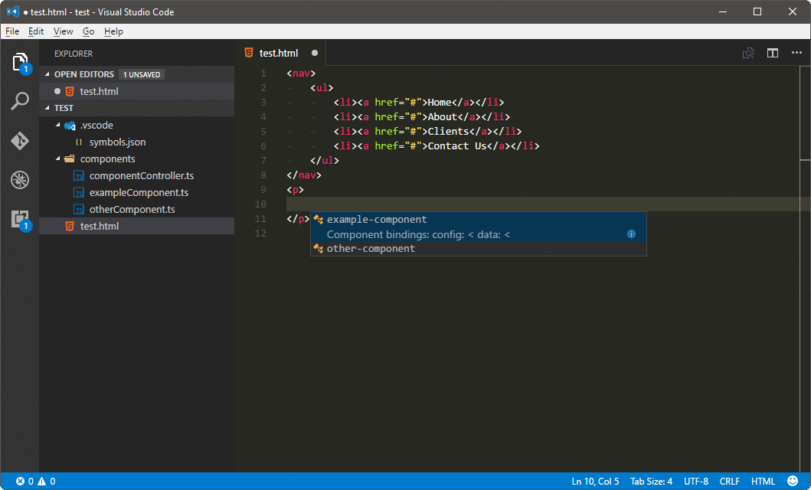
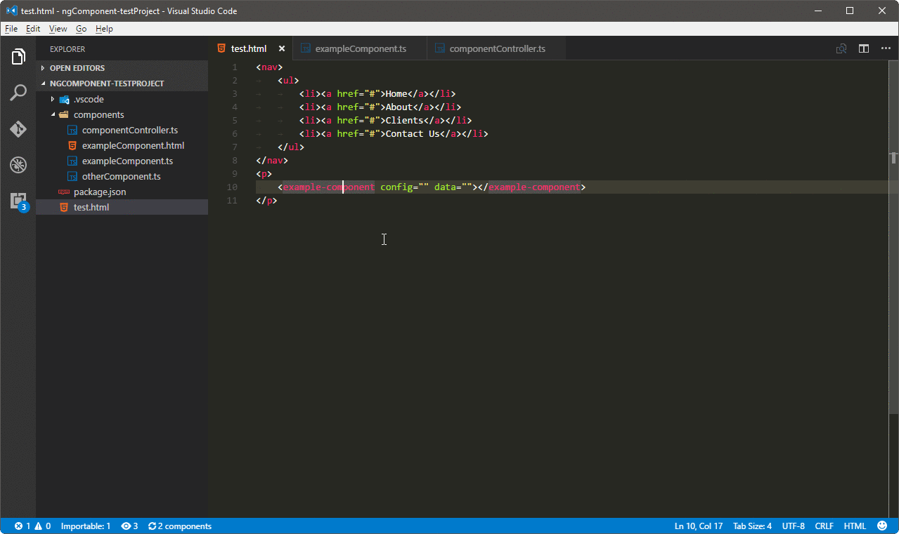

[](https://travis-ci.org/ipatalas/ngComponentUtility)
[](https://www.bithound.io/github/ipatalas/ngComponentUtility/master/dependencies/npm)
[](https://www.bithound.io/github/ipatalas/ngComponentUtility)

# Angular components intellisense

This extension is a result of hackathon event done in the company we work for. We had an option to invest 2 days into anything we could possibly want.
We chose to develop an extension for VS Code which would make our daily work easier. Our current project is an Angular 1.5 based web application. As an Angular developers we wanted to have auto-completion for all custom components that are available in our application.
This is still a preview version. It's our first attempt to VS Code extension, so not everything may be perfect.
Do not hesitate to [report](https://github.com/ipatalas/ngComponentUtility/issues) any issues you may find.

## Breaking changes

### Upgrading from 0.2.0

Please note that the configuration key has been changed from `ngIntelliSense.componentGlob` to `ngComponents.componentGlobs`. Sorry for inconvenience.

## Intellisense

Given the following components in a project:
```TypeScript
angular.module('app').component('exampleComponent', {
	/* other settings */
	bindings: {
		config: '<',
		data: '<'
	}
});

angular.module('app').component('otherComponent', {
	/* other settings */
	bindings: {
		config: '<',
		data: '<'
	}
});
```

One should be able to use auto-completion like that:



As a result component's html code along with all bindings is added.

It can also help with the bindings themselves (will only suggest missing ones):


There is now a command to refresh components cache which might be useful if you're developing components constantly and don't want to restart vscode each time.
You can trigger the command from command panel, it's called `Refresh components cache`. Alternatively you can just click the button on the status bar:


## Go To definition

You can go from html directly to either the component definition, controller or template. Just use F12 (default) or `Go To Definition` command (either from context menu or commands panel) when cursor is focused on a component in html view.
Depending on the configuration in `ngComponents.goToDefinition` specific files will show up in Go To Definition window (see screenshot below).
If there is only one file configured, let's say the template, it will go straight to this file.

### Controllers

Controllers are searched using `ngComponents.controllerGlobs` setting. They are matched against the name used in component options `controller` field.
This can be either an identifier of the class used directly or string literal specifying the name of the controller registration in Angular which basically means one can name the Angular controller differently than the class itself and this feature will still work.

### Templates

Templates are search based on either the `templateUrl` component option field or `template` field in the same component. They are mutually exclusive and both work here. Currently supported variations are:

- `templateUrl: 'components/exampleComponent.html'`
- `template: '<div>inline html template</div>'`
- `template: require('./components/exampleComponent.html')`

In case you have different scenarios please let me know the details and I'll try to include it in next version.



## Configuration

This plugin contributes the following [settings](https://code.visualstudio.com/docs/customization/userandworkspace):

- `ngComponents.componentGlobs`: array of glob strings used to search for components. Default value is  **[\*\*/\*Component.ts]**
- `ngComponents.controllerGlobs`: array of glob strings used to search for controllers (used for `Go To Definition`). Default value is  **[\*\*/\*Component.ts]**
- `ngComponents.goToDefinition`: array of strings to define which files `Go To Definition` for a component should show. Allowed values are *template*, *controller*, *component*. Default value is **["template", "controller"]**
- `ngComponents.debugConsole`: boolean value to show debug information. Default value is **false**

Whenever one of the globs changes components cache is automatically rebuilt. Additionally all component files are monitored for changes and they will be reflected immediately, ie. after adding a binding you can just save the file and go straight to template file to use that binding.

## Commands:

This extension contributes the following commands to the Command palette.

- `Refresh Components Cache`: refreshes components cache on demand

## Performance note on `ngComponents.componentGlobs` and `ngComponents.controllerGlobs`

Please use as specific globs as possible. Parsing files is only a fraction of the whole process.
Vast majority of time is consumed on "globbing" for files to be processed so the more precise the globs are the better performance you can expect.

In my example project there are around 22k files and 3k folders. Given default glob pattern it takes slightly above a second to scan all these folders to find all component files.
Restricting the pattern to one single subfolder (ie. **subdir/\*\*/\*Component.ts**) which contains only 3k files and 500 folders it goes down to around 200-300ms on my machine being almost a second faster than the default.

The bigger the project the greater the impact so in general it is better to use multiple specific patterns rather than *one pattern to glob them all* :)

## Roadmap

The following features are planned:
- ~~ability to specify multiple globs in configuration~~
- **Find all references** for components in html view
- ~~**Go to definition** for components in html view~~
	- ~~ability to pick which file to open if possible (view, component or controller)~~
	- ~~should work for both the component and it's attributes/bindings~~
- ~~auto refresh components when they change (reload only the one that has changed)~~
- ~~refresh all when configuration changes (glob for example)~~
- feature flags to disable specific functions
- rename component feature - update all usages
- ~~rethink the way components are parsed (component config is not a JSON, might contain incompatible stuff)~~
	- ~~`controller` field does not necessarily is a string, may be a class name directly~~
	- ~~`template` field may `require` a file instead of hardcoding it in the component~~
	- make sure both TypeScript and bare JS are supported (currently we focus on TS cause it's what we use)
